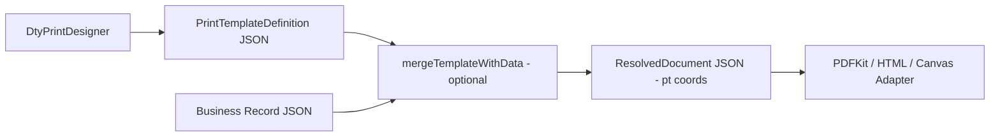

# dty-print-designer

> 浏览器端的**打印模板定义层**：三栏式可视化编辑器，产出一个可序列化的
> `PrintTemplateDefinition`（布局 + 样式 + 字段绑定），**不**内置 PDF 生成。

## 设计边界

本组件**只做 define**，不做 PDF 生成。PDF/HTML/Canvas 等最终渲染由外部
适配层消费合并产物：



- **设计器输入**：页面参数 + 样式 token + 元素树 + 字段绑定（`doc.xxx`）。
- **设计器输出**：`PrintTemplateDefinition`（`schemaVersion` 可版本化）。
- **运行时合并**：`mergeTemplateWithData(definition, record)` 生成
  `ResolvedDocument`（单位 pt，坐标系 left-top / Y 向下）。
- **PDFKit 适配层**：只负责按 `drawOps` 执行 `doc.text()` / `doc.rect()` 等。

## 快速开始

```tsx
import {
  DtyPrintDesigner,
  createDefaultTemplate,
  mergeTemplateWithData,
} from "@ctyun/react-spreadsheet-new";

const fields = [
  { name: "invoice_no", label: "Invoice #" },
  { name: "customer_name", label: "Customer" },
  {
    name: "items",
    label: "Items",
    children: [
      { name: "item_name" },
      { name: "qty" },
      { name: "amount" },
    ],
  },
];

export function Editor() {
  return (
    <DtyPrintDesigner
      defaultValue={createDefaultTemplate("Sales Invoice")}
      fields={fields}
      sampleRecord={{
        invoice_no: "INV-001",
        customer_name: "ACME",
        items: [{ item_name: "Widget", qty: 2, amount: 240 }],
      }}
      onSave={(def) => {
        // Persist `def` somewhere. Then later:
        //   const resolved = mergeTemplateWithData(def, realRecord);
        //   pdfkitAdapter.render(resolved);
      }}
    />
  );
}
```

## Props

| Prop | 类型 | 说明 |
| ---- | ---- | ---- |
| `value` | `PrintTemplateDefinition` | 受控模式的模板 JSON |
| `defaultValue` | `PrintTemplateDefinition` | 非受控模式初值 |
| `onChange` | `(def) => void` | 每次模板变化时回调 |
| `onSave` | `(def) => void` | 点击 Save 时回调（不做持久化） |
| `dataSources` | `DataSourceDescriptor[]` | 数据源选择项；由业务侧提供 |
| `activeDataSourceId` | `string` | 当前选中的数据源 id |
| `onDataSourceChange` | `(id?) => void` | 用户切换数据源时回调 |
| `fields` | `DataField[]` | 当前数据源字段元数据（可嵌套 children） |
| `onRequestFields` | `(sourceId) => DataField[] \| Promise<DataField[]>` | 按需拉取字段（与 `fields` 二选一） |
| `sampleRecord` | `Record<string, unknown>` | 画布动态字段预览用的样例数据 |
| `readOnly` | `boolean` | 只读预览 |
| `showGrid` | `boolean` | 画布网格（默认 true） |
| `zoom` | `number` | 画布缩放比例（默认 1） |

## Schema

```ts
interface PrintTemplateDefinition {
  schemaVersion: string;            // 语义化版本（当前 1.0.0）
  name: string;
  dataSource?: { id?: string; label?: string; doctype?: string };
  page: {
    uom: "mm";
    paperSizeId: "A4" | "A5" | "Letter" | "Custom";
    orientation: "portrait" | "landscape";
    widthMm: number; heightMm: number;
    margins: { topMm; rightMm; bottomMm; leftMm };
    headerHeightMm: number; footerHeightMm: number;
  };
  styles: {
    fonts: Record<string, FontToken>;
    colors: Record<string, ColorToken>;
    rules: Record<string, StyleRule>;  // 元素用 styleId 引用
  };
  elements: TemplateElement[];         // 每个元素都有 { id, type, box }
  userExtension?: { jinja?: string };  // 预留高阶扩展，v1 不执行
  metadata?: { createdAt?; updatedAt?; author?; notes? };
}
```

### 元素类型

| `type`         | 必填字段 | 说明 |
| -------------- | -------- | ---- |
| `static_text`  | `text` | 纯静态字符串 |
| `dynamic_text` | `binding`（如 `doc.invoice_no`）；`format` 可选 `"text" \| "number" \| "currency" \| "date"` | 动态字段 |
| `rectangle`    | `style.borderWidthMm` / `style.backgroundColor` | 线与填充 |
| `image`        | `src`（静态 URL）或 `binding`（字段绑定） | 图片/LOGO |
| `table`        | `repeatPath`（如 `doc.items`）、`columns[]`（每列 `binding` 以 `row.` 开头） | 子表迭代 |
| `barcode`      | `format` + `value`/`binding` | 条码/二维码（画布为占位，PDFKit 侧解码渲染） |

### 绑定表达式（v1 子集）

- 点路径：`doc.invoice_no`
- 索引：`doc.items[0].qty` 或 `doc.items.0.qty`
- 子表迭代：`table.repeatPath = "doc.items"`，子元素用 `row.<field>`

## 给 PDFKit 适配层的合同

> **详细对接需求**：见 [`docs/pdfkit-integration.md`](./docs/pdfkit-integration.md)（约 10 节，覆盖契约、错误降级、字体 fallback、测试用例、参考实现）。
>
> 本节仅给出摘要。

设计器不生成 PDF，但提供 `mergeTemplateWithData()` 生成一份
**绘制友好**的中间 JSON `ResolvedDocument`：

```ts
interface ResolvedDocument {
  schemaVersion: string;
  unit: "pt";
  coordinateSystem: "top-left-y-down";
  pages: {
    widthPt: number;
    heightPt: number;
    drawOps: DrawOp[];           // { type: "text" | "rect" | "image" | "barcode", at, ...resolved }
  }[];
}
```

PDFKit 适配层最少需要：

- **页面物理尺寸（pt）**：设计器已用 mm 定义，merge 时换算。
- **绘制指令序列**：每条类型有限、参数已解析。
- **字体/字号（pt）**：可从 styles token 或元素内联样式解析得到。
- **坐标系**：当前协议为 left-top / Y 向下；若 PDFKit 使用 left-bottom，
  由适配层做一次翻转（`yPt_pdf = pageHeightPt - yPt - heightPt`）。

```ts
// 伪代码：PDFKit 适配层
import { mergeTemplateWithData } from "@ctyun/react-spreadsheet-new";

const resolved = mergeTemplateWithData(definition, realRecord);
for (const page of resolved.pages) {
  pdfkit.addPage({ size: [page.widthPt, page.heightPt] });
  for (const op of page.drawOps) {
    if (op.type === "text") pdfkit.fillColor(op.style.color).fontSize(op.style.fontSizePt).text(op.text, op.at.xPt, op.at.yPt, { width: op.at.widthPt });
    else if (op.type === "rect") pdfkit.rect(op.at.xPt, op.at.yPt, op.at.widthPt, op.at.heightPt).stroke();
    // image / barcode ...
  }
}
```

## 版本演进

`schemaVersion` 使用 semver 字符串。如需新增字段：

1. 在 [`schema/constants.ts`](./schema/constants.ts) 升版本号。
2. 在 [`schema/migrate.ts`](./schema/migrate.ts) 登记**源版本 → 升级函数**。
3. `deserializeTemplate()` 会自动迁移。

## 快捷键

| 按键 | 功能 |
| ---- | ---- |
| `V` | 选择工具 |
| `T` | 静态文本 |
| `D` | 动态字段 |
| `R` | 矩形 |
| `I` | 图片 |
| `Delete` / `Backspace` | 删除选中 |
| `Esc` | 取消选中 / 回到选择工具 |

## 不在本组件职责里的事

- PDF / HTML 的最终打印输出
- 表格跨页切分与分页符（Phase 2）
- 协作/多 Tab 同步
- ERPNext / 特定 ORM 的 DocField 自动拉取（业务侧通过 `fields` / `onRequestFields` 注入）

## 相关文档

- [`docs/pdfkit-integration.md`](./docs/pdfkit-integration.md) —— **PDFKit 适配层对接需求文档**（工程师实现 PDF 渲染必读）
- [`schema/types.ts`](./schema/types.ts) —— 完整 schema 类型定义
- [`lib/merge.ts`](./lib/merge.ts) —— `mergeTemplateWithData` 实现
- Storybook: `DtyPrintDesigner/DtyPrintDesigner` —— 交互式示例（含 `ResolvedDrawOpsPreview` 故事，可直接查看合并后 JSON）
